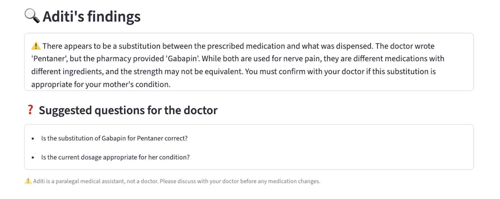
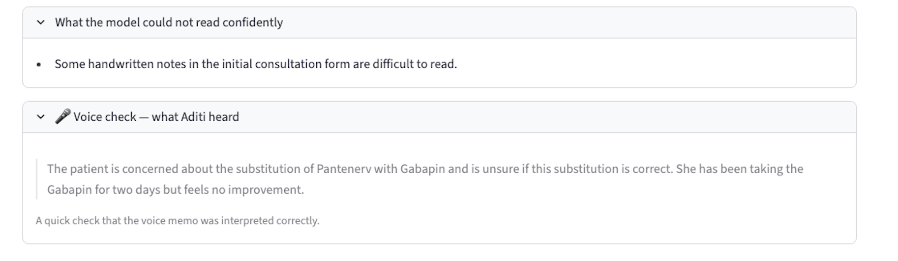
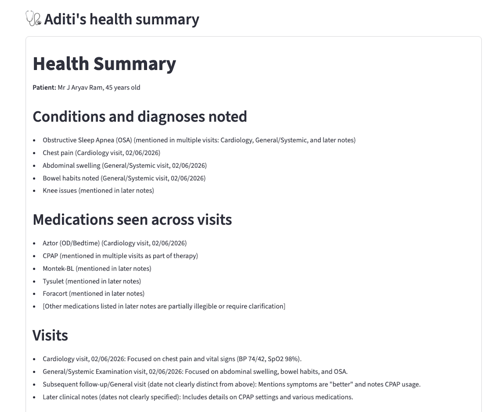

*This is a submission for the [Gemma 4 Challenge: Build with Gemma 4](https://dev.to/challenges/google-gemma-2026-05-06)*

## What I Built

When the pharmacy gave my mother a different medicine than the one her doctor had prescribed, I didn't know if the substitute was right. I didn't have hours to research. I didn't want to send her medical details to a cloud AI in another country. So I built **Aditi**, a paralegal that runs entirely on my Mac. It reads what the doctor wrote and what the pharmacy actually gave, listens to how she describes her symptoms, and organizes it into clear questions I can take to her doctor. Nothing leaves the device.

Aditi runs Google's **Gemma 4** models locally on **Apple Silicon (macOS, via MLX)**, and it uses all three on-device variants for what each is best at: the **26B MoE** for the heavy text and image work (reading messy handwriting and synthesizing many documents at once), **E4B** for voice, including Indian languages, with strong all-round quality at the edge, and **E2B** for the fastest, lightest runs. No cloud, no account, no network call.

### The case that started it

My mother is 72. She has diabetes. Last week she saw a neurologist for nerve pain in her legs and feet. The doctor wrote a prescription for **Pentanerv**. The pharmacy didn't have it, so they gave her **Gabapin (Gabapentin)** instead. Both are common treatments for nerve pain and sit in the same drug family (gabapentinoids), but they have different active ingredients and the dose does not convert one to one, so a substitution without the doctor's approval is worth questioning. After two days on the substitute, the pain hadn't reduced and she started worrying. She was not convinced Gabapin was the right substitute, and that doubt added to her stress. The pharmacist had said the substitute was equivalent, but I had questions. Was it really the same medicine? Were the dosages comparable? If the pain didn't reduce, should we switch back?

There's a second problem I kept running into. When I see a new doctor, nobody has the full picture. My history is scattered across prescriptions from a cardiologist, a pulmonologist, an orthopedist, and a gastroenterologist, plus CPAP therapy reports. I can't summarize all of that accurately from memory. I wanted Aditi to read that whole stack and hand the next doctor a clean, one-page summary.

### What Aditi does

You give Aditi three things: a short note in your own words, the prescription images (with the pharmacy bill and a photo of the dispensed tablets), and, optionally, a voice memo of the patient describing how they feel. Aditi makes a single, on-device, multimodal call to a Gemma 4 model and returns a result card: a plain-language finding at the top, the questions to ask the doctor, then the detailed extraction (what the doctor prescribed versus what the pharmacy dispensed), a bill cross-check, and a voice-interpretation check.

Here's what it produced for my mother's case, on the E4B model with a clean synthetic English voice memo as the spoken input (made with macOS's Ava Premium voice; I also recorded the same concern in Telugu, shown later):



Aditi did not hand me a verdict, and it should not. What it surfaced were the right questions. Both drugs treat the same nerve pain, but they are not interchangeable, so the things to confirm with the doctor are whether Gabapin is the correct substitute and whether its dose matches what was intended.

### The paralegal posture

Aditi is not a doctor. That is not a disclaimer. It is the entire architectural decision.

In every model call, the prompt opens with:

> *"I am the patient. Act as my paralegal medical assistant. You are NOT a doctor. You will NOT diagnose, prescribe, suggest medication changes, or make clinical judgments. Your job is to ORGANIZE and SUMMARIZE what is already in these inputs so I can have an informed conversation with my doctor and pharmacist."*

This is the defensibility argument for medical AI. When someone asks whether deploying AI for medical use is dangerous, the answer is that Aditi doesn't diagnose. It organizes. The doctor diagnoses.

This posture shapes every output Aditi produces:

- It surfaces substitutions but does not endorse them.
- It transcribes voice memos but does not interpret them clinically.
- It generates questions for the doctor but does not answer them.
- It marks unclear handwriting as uncertain rather than guessing.

## Demo



The video has captions and a full transcript (turn on CC on YouTube).

## Code



Quick start (full setup is in the README):

```bash
uv venv --python 3.11
uv pip install -r requirements.txt
uv run streamlit run src/aditi_app.py
```

You'll need a Mac with Apple Silicon (M1, M2, M3, or M4) and at least 24 GB of memory for the 26B model. The smaller E2B and E4B variants run with much less. On first run the selected model downloads from Hugging Face; after that, Aditi runs fully offline, which you can confirm by turning Wi-Fi off.

Every run in this writeup is reproducible. The JSON outputs and full result-card screenshots for all 12 cells of the test matrix (three model variants across the medicine-check conditions, plus three models for the health summary) are committed under `outputs/`.

## How I Used Gemma 4

Everything below ran on a MacBook with an M-series chip and 24 GB of unified memory, fully offline.

The model selection is tiered, but not in the obvious way. I ran a small matrix on these real cases: the three variants (E2B, E4B, 26B MoE) across the medicine-check conditions (no audio, plus English, Indian-English, and Telugu voice memos) and the multi-document health summary, twelve runs in all. Every run is saved in the repo, a JSON record and a full result-card screenshot per cell, under `outputs/`, so every claim below is checkable. The data showed something more interesting than "bigger model is better."

**26B reads handwriting cleanly enough to catch the substitution from the prescription image alone.** It correctly extracted PENTANERV-NT, PENTANERV, and the full five-drug list without confusing what was prescribed with what was dispensed (`outputs/UC1_noaudio_26b.json`).

**E2B and E4B can't do this from images alone.** E2B's handwriting OCR drifts; the same Pentanerv reads as "PENTANER" one run and "PENTENERUV" the next (`outputs/UC1_english_e2b.json`, `outputs/UC1_indianenglish_e2b.json`). E4B duplicates the dispensed drug into the prescribed list, which confuses the substitution finding (`outputs/UC1_noaudio_e4b.json`).

**But E2B and E4B can hear the voice memo, which 26B can't.** Per Google's official Gemma 4 documentation, audio is native to E2B and E4B only; the 26B and 31B variants are vision and text. A voice memo adds about 460 to 580 tokens to the prompt, but only the audio-native models actually attend to them.

So the tiers rescue each other:

- E4B uses the voice memo to recover the substitution that its image extraction alone would have missed.
- 26B uses its handwriting strength to catch the same substitution without needing audio.
- E2B catches it only when given audio. Without it, it collapses.

| Tier | Model | What it does best | Memory |
|---|---|---|---|
| **Synthesis** | Gemma 4 26B MoE 4-bit | Reads handwriting cleanly, multi-document health summaries | ~17.5 GB |
| **Multilingual audio** | Gemma 4 E4B 4-bit | Transcribes voice memos in English (US and Indian-accented) and Telugu; cleanest patient-facing prose | ~7 GB |
| **Edge / capture** | Gemma 4 E2B 4-bit | Fast (~114 tok/s), lowest memory | ~5 GB |

And the cost of each tier, measured on this case (single multimodal call, MLX, 24 GB Mac):

| Model | Peak memory | Throughput | Time for one medicine-check finding |
|---|---|---|---|
| Gemma 4 26B MoE 4-bit | ~17.7 GB | ~35 to 40 tok/s | ~24 s |
| Gemma 4 E4B 4-bit | ~7.1 GB | ~66 tok/s | 8 to 15 s |
| Gemma 4 E2B 4-bit | ~5.4 GB | ~114 tok/s | 4 to 6 s |

The finding behind this is that audio support is a Google design choice, not a model capability ceiling. E2B and E4B are built for on-device deployment where voice input is natural. 26B and 31B are built for server contexts where text and images dominate. Prompt engineering can't change that; it is baked in. Aditi handles it honestly: pick a vision-only model and the voice-check panel says *"audio not used by this model"* instead of pretending it listened.

### Voice memos in Indian languages

One thing surprised me in testing: **Gemma 4 E4B handles Telugu voice memos cleanly.** My mother and I both speak Telugu, so I recorded the same concern as a Telugu voice memo, and E4B extracted it accurately (full record in `outputs/UC1_telugu_e4b.json`):

> *E4B's output on a Telugu voice memo: "concerned about the substitution of Pantenerv with Gabapin… She has been taking the Gabapin for two days but feels no improvement."*



This matters for Indian patients who explain their symptoms most naturally in their regional language, not in English. The architecture takes this seriously: E4B handles the multilingual audio tier, and 26B handles the precise document extraction tier. The user doesn't choose; the app picks the right model for the input modality.

This is one data point with one Telugu memo, and wider testing across more regional languages would be useful future work. But for my mother's case, Telugu support means Aditi works for *her*, not just for me.

### Beyond a single visit: the health story

Aditi also handles a second use case: reading prescriptions from multiple specialists across visits and producing a synthesized health summary.

I tested this on 8 documents (six specialist prescriptions covering orthopedics, pulmonology, cardiology, and gastroenterology, plus two CPAP reports) and asked Aditi to produce a Markdown summary covering conditions and diagnoses, medications across visits, a visit timeline, tests and investigations, items that couldn't be read clearly, and questions for the doctor. The full output for each model is in `outputs/UC2_summary_26b.json`, `outputs/UC2_summary_e4b.json`, and `outputs/UC2_summary_e2b.json`.

A slice of what 26B produced across those 8 documents:

> **Health Summary.** Patient name and age.
>
> **Conditions:** Obstructive Sleep Apnea (noted across the cardiology and general examination visits), chest pain (cardiology), abdominal swelling, knee issues.
>
> **Medications across visits:** Aztor (bedtime), CPAP therapy, Montek-BL, Tysulet, Foracort.
>
> **Visits:** Cardiology (02/06/2026), chest pain and vitals; general examination, abdominal swelling and bowel habits.



For multi-document synthesis, **26B is clearly the right model.** It consolidates recurring conditions across visits (obstructive sleep apnea showing up in multiple documents, for instance) and integrates CPAP data into the broader medical picture. The smaller models struggle here: E4B falls into a repetition loop and drops the medication list (`outputs/UC2_summary_e4b.json`), which is the same edge-model limitation the substitution case showed.

## What can go wrong

Aditi has a bill cross-check that matches extracted prescribed drugs against names printed on the pharmacy bill, then flags discrepancies. It works when extraction is clean. When extraction is messy, as it sometimes is on the E2B model, the cross-check can produce false positives.

In one test run, E2B flagged "VENTIN to GABAPENTIN" as a possible misread of the same drug. They are actually different drugs; the fuzzy-match threshold (0.6) was too loose for that pair. The cross-check correctly surfaces uncertainty, but the similarity check itself is blunt, and it mismatched here.

This is the right kind of failure to surface. The cross-check never overrides the model; it only flags. If the model gets confused, the flag shows it. If the cross-check itself is confused, that is visible too. Both signals reach the doctor.

## What Aditi doesn't do

Honesty about scope matters in medical AI. Aditi:

- **Doesn't diagnose anything.** Aditi never says "this is safe" or "this is the right medicine." Those are doctor questions.
- **Doesn't recommend dose changes.** Even when medications are clearly in the same drug family, the dose conversion (for example, Pentanerv versus Gabapin) depends on patient-specific factors.
- **Runs on Mac only.** An iPhone prototype tested during research exposed five distinct failure modes, which is what led to the Mac-only design.
- **Tested on two real cases in depth**, not at clinical scale.
- **Did not test the 31B Dense Gemma 4 variant** due to memory constraints.

These are real limitations. I list them because confidence in medical AI comes from honesty about what it can and can't do.

## Privacy by architecture

Every model call, every voice memo, and every prescription image stays on the Mac. There is no API call to a vendor server. There is no telemetry; the app even disables Streamlit's usage stats. The model weights are downloaded once and cached locally.

I built Aditi this way because the alternative, sending my mother's prescription, her medical history, and her voice describing her pain to a server in another country, felt wrong. It probably is wrong, under India's Digital Personal Data Protection Act 2023 and other privacy norms.

And beyond the law, this is personal. A family's medical history, including the conditions people are ashamed to talk about, is some of the most sensitive data a person owns. It should not have to leave the house to be useful to the people it belongs to.

I treated privacy as an architectural choice from the start, not a feature to add at the end.

## Consent and the case data

The images in this submission come from two real cases: my mother's medication-substitution case, used with her informed verbal consent, and my own multi-visit history (the health-summary case). All identifying information (patient names, doctor names, hospital names, IDs, addresses, phone numbers, signatures) has been substituted with fictional alternatives or redacted. Drug names, dosages, complaints, and medical content are preserved exactly so the model's extraction capability can be demonstrated honestly.

Aditi is one honest paralegal on a person's own device. It reads what the doctor wrote, hears what the patient said, and helps the patient ask the right questions. That was the point.

*Cover photo: Arthur's Seat, Edinburgh, 2020, the vast and beautiful sweep of green hills above the city. The name Aditi means "the boundless one," which felt right for a tool meant to give care without limits, as open as that landscape.*

*Kalyan Ram Jaladi, writing from Hyderabad, India.*
