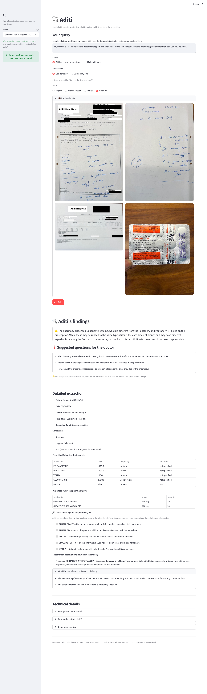
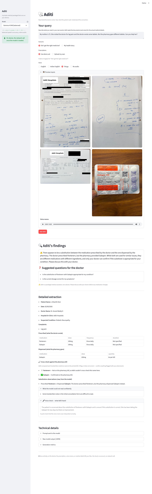
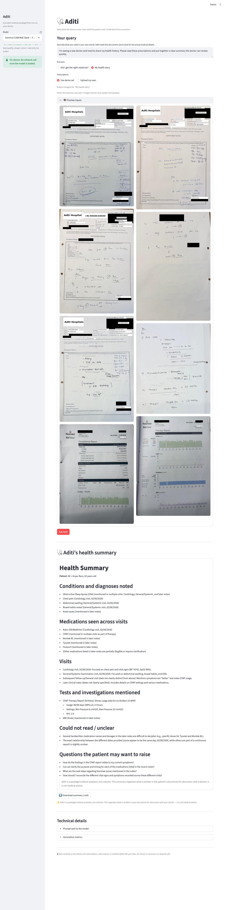

# Aditi: A medical paralegal to the patient, a partner to the doctor

When my mother's pharmacist swapped her prescription, I didn't know if the substitute was right.
I didn't have hours to research. I didn't want to send her medical details to a cloud AI in
another country. So I built Aditi — a paralegal that runs entirely on my MacBook. It reads what
the doctor wrote and what the pharmacy actually gave, listens to how she describes her symptoms,
and organizes it all into clear questions I can take to her doctor. Nothing leaves the device.

▶︎ **Watch the 90-second demo:** `<VIDEO_URL>`  *(replace with the uploaded video link)*

## The case that started it

My mother is 72. She has diabetes. Last week she saw a neurologist for nerve pain in her legs
and feet. The doctor wrote a prescription for **Pentanerv**. The pharmacy didn't have it, so they
gave her **Gabapin** instead. After two days on the substitute, the pain hadn't reduced and mother
started worrying. She was not convinced that Gabapin was the right substitute, and that doubt
aggravated her stress more. The pharmacist had said the substitute was equivalent, but I had
questions. Was it really the same medicine? Were the dosages comparable? If the pain didn't
reduce, should we switch back?

I needed a tool that could read the prescription, the bill, and her own description of how she
was feeling — and organize it all into something I could discuss with the doctor at her next visit.

There's a second problem I kept running into. When I see a *new* doctor, nobody has the full
picture. My history is scattered across prescriptions from a cardiologist, a pulmonologist, an
orthopedist, a gastroenterologist — plus CPAP therapy reports. I can't summarize all
of that accurately from memory. I wanted Aditi to read that whole stack and
hand the next doctor a clean, one-page summary.

## What Aditi does

You give Aditi three things: a short note in your own words, the prescription images (with the
pharmacy bill and a photo of the dispensed tablets), and — optionally — a voice memo of the patient
describing how they feel. Aditi makes a single, on-device, multimodal call to a Gemma 4 model and
returns a result card: a plain-language finding at the top, the questions to ask the doctor, then
the detailed extraction (what the doctor prescribed vs. what the pharmacy dispensed), a bill
cross-check, and a voice-interpretation check.

Here's what it produced for my mother's case, on the 26B model:

> **The pharmacy dispensed Gabapentin 100 mg, which is different from the Pentanerv and
> Pentanerv-NT listed on the prescription. While these may be related to the same type of issue,
> they are different brands and may have different ingredients or strengths. You must confirm with
> your doctor if this substitution is correct and if the dose is appropriate.**
>
> **Suggested questions for the doctor:**
> - The pharmacy provided Gabapentin 100 mg; is this the correct substitute for the Pentanerv and Pentanerv-NT prescribed?
> - Are the doses of the dispensed medication equivalent to what was intended in the prescription?
> - How should the prescribed medications be taken in relation to the ones provided by the pharmacy?

That output answers what I needed to know. I'm taking my mother to the doctor with these specific
questions in hand.


*Aditi's result card for UC1 — the substitution finding, suggested questions, and the detailed
prescribed-vs-dispensed extraction (Gemma 4 26B).*

## The paralegal posture

Aditi is not a doctor. This isn't a disclaimer — it's the entire architectural decision.

In every model call, the prompt opens with:

> *"I am the patient. Act as my paralegal medical assistant. You are NOT a doctor. You will NOT
> diagnose, prescribe, suggest medication changes, or make clinical judgments. Your job is to
> ORGANIZE and SUMMARIZE what is already in these inputs so I can have an informed conversation
> with my doctor and pharmacist."*

This is the defensibility argument for medical AI. When someone asks "isn't deploying AI for
medical use dangerous?" — the answer is: Aditi doesn't diagnose. It organizes. The doctor diagnoses.

This posture shapes every output Aditi produces:
- It surfaces substitutions, doesn't endorse them
- It transcribes voice memos, doesn't interpret them clinically
- It generates questions for the doctor, doesn't answer them
- It marks unclear handwriting as uncertain, doesn't guess

## How it works — and what the data showed

Aditi runs Google's **Gemma 4** model family entirely on Apple Silicon (a MacBook with M3/M4,
24 GB unified memory). Nothing leaves the device. No API calls. No cloud uploads. No data given
to a third party.

The model selection is tiered, but not in the obvious way. I tested all three variants (E2B, E4B,
26B MoE) across four input conditions on this real case — twelve runs in all. The data showed
something more interesting than "bigger model is better":

**26B reads handwriting cleanly enough to catch the substitution from the prescription image
alone.** It correctly extracted PENTANERV-NT, PENTANERV, and the full five-drug list without
confusing what was prescribed with what was dispensed.

**E2B and E4B can't do this from images alone.** E2B's handwriting OCR drifts — Pentanerv becomes
"VENTIN" or "PENTENERUV" run to run. E4B duplicates the dispensed drug into the prescribed list,
confusing the substitution finding.

**But E2B and E4B can hear the voice memo, which 26B can't.** Per Google's official Gemma 4
documentation, audio is native to E2B and E4B only; the 26B and 31B variants are vision+text.
A voice memo adds about 460–580 tokens to the prompt, but only the audio-native models actually
attend to them.

**So the tiers rescue each other:**
- E4B uses the voice memo to recover the substitution that its image extraction alone would have missed
- 26B uses its handwriting strength to catch the same substitution without needing audio
- E2B catches it only when given audio; without it, it collapses

| Tier | Model | What it does best | Memory |
|---|---|---|---|
| **Synthesis** | Gemma 4 26B MoE 4-bit | Reads handwriting cleanly, multi-document health summaries | ~17.5 GB |
| **Multilingual audio** | Gemma 4 E4B 4-bit | Transcribes voice memos in English (US and Indian-accented) and Telugu; cleanest patient-facing prose | ~7 GB |
| **Edge / capture** | Gemma 4 E2B 4-bit | Fast (~114 tok/s), low-memory; v2 candidate for iPhone | ~5 GB |

And the cost of each tier, measured on this case (single multimodal call, MLX, 24 GB Mac):

| Model | Peak memory | Throughput | Time for one UC1 finding |
|---|---|---|---|
| Gemma 4 26B MoE 4-bit | ~17.7 GB | ~35–40 tok/s | ~24 s |
| Gemma 4 E4B 4-bit | ~7.1 GB | ~66 tok/s | 8–15 s |
| Gemma 4 E2B 4-bit | ~5.4 GB | ~114 tok/s | 4–6 s |

The architectural finding behind this: **audio support is a Google design choice, not a model
capability ceiling.** E2B and E4B are built for on-device deployment where voice input is natural.
26B and 31B are built for server contexts where text and images dominate. That's not something
prompt engineering can change; it's baked in. (Aditi treats it honestly: pick a vision-only model
and the voice-check panel says *"audio not used by this model"* rather than pretending it listened.)

## Voice memos in Indian languages

One thing surprised me in testing: **Gemma 4 E4B handles Telugu voice memos cleanly**. My mother
and I both speak Telugu. If she'd recorded her concern in Telugu instead of English, E4B would
still have extracted it accurately:

> *E4B's output on a Telugu voice memo: "concerned about the substitution of Pantenerv with Gabapin…
> She has been taking the Gabapin for two days but feels no improvement."*


*Same prescription, voice memo in Telugu — E4B transcribes the spoken concern. On the same input,
26B's voice-check panel honestly reports "audio not used by this model."*

This matters for Indian patients who explain their symptoms most naturally in their regional
language, not English. The architecture takes this seriously: E4B handles the multilingual audio
tier, 26B handles the precise document extraction tier. The user doesn't choose; the app picks
the right model for the input modality.

This is one data point with one Telugu memo, and wider testing across more regional languages
would be informative future work. But for my mother's case, Telugu support means Aditi works for
*her* — not just for me.

## Beyond a single visit: the health story

Aditi v1 also handles a second use case: reading prescriptions from multiple specialists across
visits and producing a synthesized health summary.

We tested this on 8 documents (six specialist prescriptions covering orthopedics, pulmonology,
cardiology, gastroenterology + two CPAP reports) and asked Aditi to produce a Markdown summary
covering conditions and diagnoses, medications across visits, a visit timeline, tests and
investigations, items that couldn't be read clearly, and questions for the doctor.

A slice of what 26B produced across those 8 documents:

> **# Health Summary** — *Patient: …, 45*
> **Conditions:** Obstructive Sleep Apnea (noted across the Cardiology and General/Systemic visits),
> chest pain (Cardiology), abdominal swelling, knee issues…
> **Medications across visits:** Aztor (bedtime), CPAP therapy, Montek-BL, Tysulet, Foracort…
> **Visits:** Cardiology (02/06/2026) — chest pain, vitals; General/Systemic — abdominal swelling,
> bowel habits…

Notice it refers to each finding **by specialty and date — never "document 1/2/3"** — because this
is a print a doctor will actually read.


*Multi-document health summary across 8 documents including CPAP reports, with a one-click Markdown
download (Gemma 4 26B).*

For multi-document synthesis, **26B is clearly the right model.** It consolidates recurring
conditions across visits (obstructive sleep apnea showing up in multiple documents, for instance)
and integrates CPAP data into the broader medical picture. The output is detailed, ordered, and
stays within the paralegal posture throughout.

Same architecture, more documents in, richer summary out. This is the longitudinal use case Aditi
v1 already supports.

## What can go wrong — and what I learned about my own system

Aditi v1 has a bill cross-check that matches extracted prescribed drugs against names printed on
the pharmacy bill, then flags discrepancies. It works when extraction is clean. When extraction is
messy — as it sometimes is on the E2B model — the cross-check can produce false positives.

In one test run, E2B flagged "VENTIN → GABAPENTIN" as a possible misread of the same drug. They're
actually different drugs; the fuzzy-match threshold (0.6) was too loose for that pair. The
cross-check correctly surfaces uncertainty, but the underlying similarity check needs tightening
for v2.

This is the right kind of failure to surface. The cross-check never overrides the model; it only
flags. If the model gets confused, the flag shows it. If the cross-check itself is confused,
that's visible too. Both signals reach the doctor.

For v2: tighten the fuzzy-match threshold or require a shared prefix before flagging.

## What Aditi doesn't do

Honesty about scope matters in medical AI. Aditi v1:

- **Doesn't diagnose anything.** Aditi never says "this is safe" or "this is the right medicine."
  Those are doctor questions.
- **Doesn't recommend dose changes.** Even when medications are clearly in the same drug family,
  the dose conversion (e.g., Pentanerv vs. Gabapin) depends on patient-specific factors.
- **Runs on Mac only.** A v2 iPhone app will handle one-tap capture; Mac will handle synthesis.
  The iPhone prototype tested during research exposed five distinct failure modes that informed
  v1's Mac-only decision.
- **Tested on one real case in depth.** Wider clinical validation is future work.
- **The 31B Dense Gemma 4 variant was not tested in v1** due to memory constraints. It's a
  candidate for v2's hardest extraction cases.

These are real limitations. I list them because confidence in medical AI comes from honesty about
what it can and can't do.

## Privacy by architecture

Every model call, every voice memo, every prescription image stays on the Mac. There is no API
call to a vendor server. There is no telemetry (the app even disables Streamlit's usage stats).
The model weights are downloaded once and cached locally.

I built Aditi this way because the alternative — sending my mother's prescription, her medical
history, her voice describing her pain to a server in another country — felt wrong. It probably is
wrong, under India's Digital Personal Data Protection Act 2023 and other privacy norms.

Privacy isn't a feature you add later. It's an architectural choice you make at the start.

## Consent and the case data

The prescription images in this submission are from my mother's real case, used with her informed
verbal consent. All identifying information (patient name, doctor names, hospital names, IDs,
addresses, phone numbers, signatures) has been substituted with fictional alternatives or redacted.
Drug names, dosages, complaints, and medical content are preserved exactly so the model's
extraction capability can be demonstrated honestly.

## Try it

The repo is at `<your GitHub URL>`. Quick start (full setup is in the README):

```bash
uv venv --python 3.11
uv pip install -r requirements.txt
uv run streamlit run src/aditi_app.py
```

You'll need a Mac with Apple Silicon (M1/M2/M3/M4) and at least 24 GB of memory for the 26B model;
the smaller E2B/E4B variants run with much less. On first run the selected model downloads from
Hugging Face; after that, Aditi runs fully offline — confirm by turning Wi-Fi off.

Every run in this writeup is reproducible: the JSON outputs and full result-card screenshots for
all 12 cells of the test matrix (three model variants × four input conditions for UC1, plus three
models for UC2) are committed under `outputs/`.

## Where this goes

- **A v2 iPhone app for one-tap capture.** The edge models' native audio makes the phone the
  natural place to record the patient's voice; the Mac stays the synthesis tier.
- **A verified drug-name backstop** to tighten the bill cross-check — the VENTIN false positive
  showed exactly why fuzzy matching alone isn't enough.
- **Wider regional-language testing**, building on the Telugu result.
- **The 31B Dense variant** for the hardest handwriting.

Aditi v1 is one honest paralegal on one person's device — reading what the doctor wrote, hearing
what the patient said, and helping the patient ask the right questions. That was the point.

---

*Aditi by Kalyan Ram Jaladi. Built for the Gemma 4 Challenge. Hyderabad, May 2026.*
